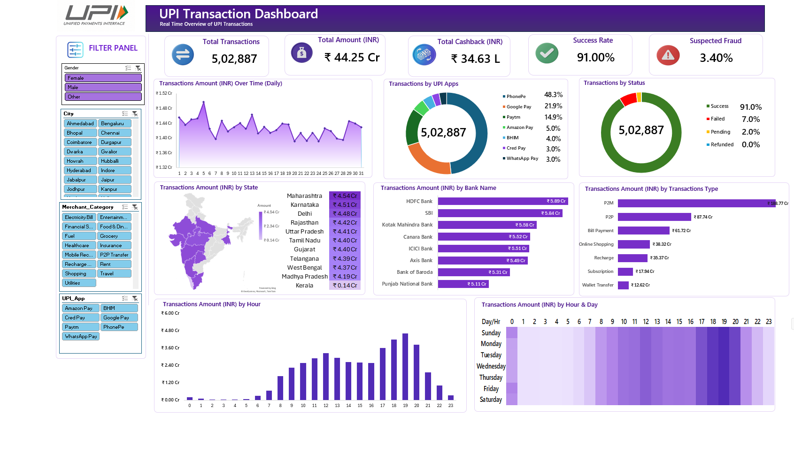

# 💳 UPI Payment Analysis — Microsoft Excel Dashboard

An interactive **UPI Payment Analysis Dashboard** built using **Microsoft Excel** to analyze digital payment transactions and uncover meaningful trends, patterns, and business insights.

The project focuses on transforming raw UPI/PhonePe transaction data into a clean, interactive dashboard using Excel's data analysis and visualization capabilities.

---

## 📊 Dashboard Preview



---

## 📌 Project Overview

Digital payments have become an important part of everyday financial transactions in India. UPI-based payments generate large amounts of transactional data that can be analyzed to understand customer behavior, transaction patterns, payment trends, and overall performance.

In this project, raw UPI/PhonePe transaction data was cleaned, analyzed, and transformed into an interactive Excel dashboard.

The objective is to answer important analytical questions such as:

- How are UPI transactions distributed across different categories?
- Which payment categories contribute the most to transaction volume?
- What are the major transaction trends?
- Which segments show higher transaction activity?
- What patterns can be identified from the available transaction data?
- How can raw payment data be converted into meaningful business insights?

---

## 🎯 Project Objectives

The main objectives of this project are:

- Clean and prepare raw UPI transaction data
- Perform exploratory data analysis using Excel
- Identify important transaction patterns
- Analyze payment behavior
- Create meaningful KPIs
- Build interactive visualizations
- Design an easy-to-understand Excel dashboard
- Generate actionable insights from transactional data

---

## 🛠️ Tools & Technologies

| Tool | Purpose |
|---|---|
| **Microsoft Excel** | Data cleaning, analysis & dashboard |
| **Excel Functions** | Data transformation & calculations |
| **Pivot Tables** | Data aggregation & analysis |
| **Pivot Charts** | Data visualization |
| **Slicers** | Interactive filtering |
| **Conditional Formatting** | Highlighting important values |

---

## 📁 Project Structure

```text
UPI Payment Analysis/
│
├── imgs/
│   └── Supporting images
│
├── dashboard_imgs/
│   └── dashboard.png
│
├── phonepay_raw_data.xlsx
│
└── README.md
```

---

## 📂 Dataset

The project uses a raw UPI/PhonePe transaction dataset stored in:

```
phonepay_raw_data.xlsx
```

The dataset contains transaction-related information that can be used to analyze payment activity and identify trends across different dimensions.

### Dataset Workflow

```
Raw Transaction Data
        ↓
Data Cleaning
        ↓
Data Transformation
        ↓
Pivot Tables
        ↓
KPI Calculations
        ↓
Charts & Visualizations
        ↓
Interactive Dashboard
        ↓
Business Insights
```

---

## 🧹 Data Preparation

Before creating the dashboard, the raw dataset was prepared for analysis.

The data preparation process included:

- Inspecting the raw dataset
- Checking data types
- Handling missing or inconsistent values
- Removing unnecessary information
- Formatting date/time fields
- Creating calculated fields where required
- Ensuring consistent categories
- Preparing the dataset for Pivot Table analysis

---

## 📊 Excel Analysis

The project uses several Excel features to analyze the UPI transaction data.

### Pivot Tables

Pivot Tables were used to summarize transaction data and identify patterns across different dimensions.

They helped in:

- Aggregating transaction records
- Comparing categories
- Summarizing transaction activity
- Identifying high-performing segments
- Supporting dashboard visualizations

### Excel Functions

Excel formulas and functions were used for:

- Data transformation
- Calculated metrics
- Categorization
- Conditional analysis
- KPI calculations

### Conditional Formatting

Conditional formatting was used to make important values and trends easier to identify.

---

## 📈 Dashboard

The final dashboard converts the analyzed transaction data into an interactive visual report.

### Dashboard Components

The dashboard includes:

- 📌 Key Performance Indicators
- 📊 Transaction analysis
- 📈 Trend analysis
- 📉 Comparative analysis
- 🔎 Category-level insights
- 🎛️ Interactive filters/slicers
- 📊 Excel charts and visualizations

The dashboard is designed to provide a quick overview of the payment data without requiring users to manually analyze the raw dataset.

---

## 💡 Key Insights

The dashboard can be used to identify:

- Overall transaction activity
- High-volume payment categories
- Transaction trends over time
- Distribution of payments across different segments
- Areas with relatively higher or lower transaction activity
- Patterns in customer payment behavior

> **Note:** The insights are derived directly from the analyzed dataset and dashboard rather than assumptions about the UPI ecosystem.

---

## 🔍 Analytical Approach

The project follows a structured data analytics workflow:

### 1. Data Collection

Imported the raw UPI/PhonePe transaction dataset into Microsoft Excel.

### 2. Data Cleaning

Inspected and prepared the raw data for further analysis.

### 3. Data Transformation

Created the required calculated fields and standardized the dataset.

### 4. Exploratory Analysis

Used Pivot Tables and Excel functions to explore transaction patterns.

### 5. Visualization

Created charts to represent important trends and comparisons.

### 6. Dashboard Development

Combined KPIs, charts, filters, and supporting visuals into a single interactive dashboard.

### 7. Insight Generation

Used the dashboard to identify meaningful patterns in the transaction data.

---

## 📷 Dashboard

The final dashboard is available in:

```
dashboard_imgs/dashboard.png
```

---

## 🚀 How to Use

### 1. Clone the Repository

```bash
git clone https://github.com/theaditya24/MS-excel-for-Data-Analytics.git
```

### 2. Navigate to the Project

```bash
cd MS-excel-for-Data-Analytics/Projects/UPI%20Payment%20Analysis
```

### 3. Open the Excel File

Open:

```
phonepay_raw_data.xlsx
```

using Microsoft Excel.

### 4. Explore the Analysis

Use the Pivot Tables, calculations, charts, filters, and dashboard components to explore the transaction data.

---

## 📚 Skills Demonstrated

This project demonstrates practical skills in:

- Microsoft Excel
- Data Cleaning
- Data Transformation
- Exploratory Data Analysis
- Pivot Tables
- Pivot Charts
- Excel Formulas
- KPI Development
- Dashboard Design
- Data Visualization
- Business Analysis
- Data Storytelling

---

## 💼 Business Value

A payment analytics dashboard like this can help businesses:

- Understand transaction behavior
- Identify high-performing payment categories
- Monitor transaction trends
- Compare different segments
- Support data-driven decision making
- Present large datasets in an easy-to-understand format

---

## 🔮 Future Improvements

Possible improvements for this project include:

- Add more advanced KPIs
- Add monthly and yearly trend analysis
- Add customer segmentation
- Add transaction-value analysis
- Add geographic analysis if location data is available
- Automate data refresh using Power Query
- Build a Power BI version of the dashboard
- Connect the dashboard to an automatically updating data source

---

## 👨‍💻 Author

**Aditya Raj**

**Data Analyst | Excel | SQL | Python | Power BI**

### 🔗 GitHub https://github.com/theaditya24


---

## ⭐ If You Like This Project

If you found this project useful or interesting, consider giving the repository a ⭐ on GitHub.
